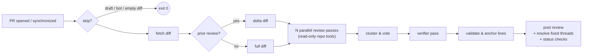

<p align="center">
  
  <h1 align="center">HoverStare</h1>
  <p align="center">
    <b>KI-Code-Review, das dein Repository wirklich liest.</b>
  </p>
  <p align="center">
    <i>Der Name stammt aus dem Filmgag „凌空瞪“ von Stephen Chow: ein losgelöster Augapfel, der in der Luft schwebt und einen anstarrt.</i>
  </p>
  <p align="center">
    <a href="https://github.com/liuchong/hoverstare/actions/workflows/ci.yml"></a>
    <a href="https://github.com/liuchong/hoverstare/releases"></a>
    <a href="https://crates.io/crates/hoverstare"></a>
    <a href="https://license.pub/1pl/"></a>
  </p>
  <p align="center">
    <a href="README.md">English</a> ·
    <a href="README.zh-CN.md">简体中文</a> ·
    <a href="README.ru.md">Русский</a> ·
    <a href="README.fr.md">Français</a> ·
    <b>Deutsch</b> ·
    <a href="README.es.md">Español</a>
  </p>
</p>

<br/>

HoverStare ist ein KI-Code-Review-Bot für GitHub-Pull-Requests, geschrieben in
Rust und ausgeliefert als einzelne statische Binärdatei, die als GitHub Action
läuft. Statt den Diff in einem Zug an ein Modell zu werfen, **liest der
Reviewer dein Repository wie ein Mensch** — öffnet Kontextdateien, sucht
Aufrufstellen per grep, vergleicht mit dem Basis-Branch — bevor er etwas
meldet. Ein Mehrfach-Voting plus unabhängiger Verifizierer hält falsch
Positive niedrig, und jeder Befund wird über Commits hinweg verfolgt, bis er
behoben ist.

## Warum HoverStare?

- 🔍 **Repo-bewusst statt nur Diff.** Das Modell bekommt schreibgeschützte
  Werkzeuge (`read_file` / `grep` / `glob` / `show_base_file`) und prüft
  Verdachtsfälle vor der Meldung nach. Es findet Bugs, die *außerhalb* des
  Diffs liegen — z. B. eine geänderte Funktion, deren Aufrufer zwei Dateien
  weiter brechen.
- 🗳️ **Mehrfach-Voting + Verifizierer.** Drei unabhängige Durchläufe
  (Korrektheit / Nebenläufigkeit / Sicherheit) stimmen über Befunde ab;
  Befunde mit nur einer Stimme müssen einen unabhängigen Verifizierer mit
  Werkzeugzugriff bestehen.
- 📌 **Präzise Inline-Kommentare.** Zeilennummern werden gegen den echten Diff
  validiert und auf den nächsten gültigen Ankerpunkt gesnappt — Kommentare
  landen exakt dort, wo der Bug ist.
- 🔁 **Inkrementelle Reviews.** Nach einem Fix reviewt HoverStare nur das Delta,
  markiert behobene Befunde als resolved (oder hinterlässt „✅ Fix bestätigt")
  und wiederholt sich nie.
- 🛡️ **Fail-open by Design.** Netzwerkprobleme, Rate-Limits oder ein
  unzuverlässiges Modell blockieren niemals deine CI.
- 🔑 **BYOK.** Eigener Schlüssel: Anthropic oder jeder OpenAI-kompatible
  Endpoint (Kimi, DeepSeek, OpenRouter, …). Code geht direkt an deinen
  Anbieter.

## Wie es funktioniert



Jeder Inline-Kommentar trägt einen versteckten Fingerabdruck (Hash aus
`Pfad + Codezeile + Titel`). Beim nächsten Push vergleicht HoverStare mit seinem
vorherigen Review, fragt das Modell, welche offenen Befunde behoben sind, und
behandelt diese Threads — immun gegen Zeilennummern-Drift.

## Schnellstart (2 Minuten)

**1. Workflow hinzufügen** — `.github/workflows/hoverstare.yml`:

```yaml
name: HoverStare
on:
  pull_request:
    types: [opened, reopened, synchronize]
  issue_comment:
    types: [created]
  pull_request_review_comment:
    types: [created]

permissions:
  contents: read
  pull-requests: write
  statuses: write

concurrency:
  group: hoverstare-${{ github.event.pull_request.number || github.event.issue.number }}
  cancel-in-progress: true

jobs:
  hoverstare:
    runs-on: ubuntu-latest
    steps:
      - uses: actions/checkout@v4
        with:
          fetch-depth: 0
      - uses: liuchong/hoverstare@v0
        env:
          GITHUB_TOKEN: ${{ secrets.GITHUB_TOKEN }}
          OPENAI_API_KEY: ${{ secrets.HOVERSTARE_LLM_KEY }}
          OPENAI_BASE_URL: ${{ vars.HOVERSTARE_LLM_BASE_URL }}
          HOVERSTARE_MODEL: ${{ vars.HOVERSTARE_MODEL }}   # z. B. kimi-for-coding
```

**2. LLM-Zugangsdaten konfigurieren** (eine Option):

| Anbieter | Einstellungen |
|---|---|
| **Anthropic** | Secret `ANTHROPIC_API_KEY` (Standardmodell `claude-sonnet-4-6`) |
| **OpenAI-kompatibel** (Kimi, DeepSeek, OpenRouter…) | Secret `OPENAI_API_KEY`, Variable `OPENAI_BASE_URL` (z. B. `https://api.kimi.com/coding/v1`), Modellname via `HOVERSTARE_MODEL` oder `model` in `.github/hoverstare.toml` |

> ⚠️ Bei einem OpenAI-kompatiblen Endpoint **musst** du den Modellnamen
> setzen — das Standardmodell `claude-sonnet-4-6` existiert dort nicht.

**3. (Optional) Repo-Konfiguration** — `.github/hoverstare.toml`, alle Felder optional:

```toml
model = "kimi-for-coding"             # Haupt-Review-Modell
reformat_model = "kimi-for-coding-highspeed"  # günstiges Modell für Ausgabe-Reparatur
passes = 3                            # parallele Durchläufe; 1 deaktiviert Voting
verify = true                         # Verifizierer für Ein-Stimmen-Befunde
severity_threshold = "medium"         # darunter → nur Nitpicks-Abschnitt
ignore = ["*.lock", "**/dist/**", "**/*.min.js"]
max_diff_kb = 400                     # Diff-Budget (prioritätsgesteuerte Kürzung)
max_tool_calls = 20                   # Werkzeug-Budget der Agentenschleife
timeout_secs = 900
review_drafts = false
fail_closed = false                   # true → Analysefehler lassen CI fehlschlagen
status_checks = false                 # hoverstare / hoverstare-findings Checks schreiben
set_temperature = true                # false für Endpoints, die nur Standard-Temperatur akzeptieren
instructions = ""                     # team-spezifischer Review-Fokus, wird in den Systemprompt injiziert
```

## Optional: Markenidentität (hoverstare[bot])

Standardmäßig werden Reviews als `github-actions[bot]` veröffentlicht
(eine `GITHUB_TOKEN`-Einschränkung — Name und Avatar sind nicht anpassbar).
Um als **hoverstare[bot]** mit Projekt-Avatar zu veröffentlichen:

1. Installiere die **HoverStare** GitHub App in deinem Repo
2. Kopiere in den App-Einstellungen die **App ID** und generiere einen **private key**
3. Hinterlege sie als Secrets `HOVERSTARE_APP_ID` und `HOVERSTARE_APP_PRIVATE_KEY`
4. Übergib sie an die Action:

```yaml
      - uses: liuchong/hoverstare@v0
        with:
          app_id: ${{ secrets.HOVERSTARE_APP_ID }}
          app_private_key: ${{ secrets.HOVERSTARE_APP_PRIVATE_KEY }}
```

> Bonus: Ein App-Installation-Token unterliegt nicht der
> `resolveReviewThread`-Einschränkung des `GITHUB_TOKEN` — behobene Threads
> werden vollständig aufgelöst (kein `GH_PAT` nötig).

## `@hoverstare`-Befehle

In einem PR posten (nur Repo-Kollaboratoren):

| Befehl | Wirkung |
|---|---|
| `@hoverstare review` | Erzwingt ein komplettes Re-Review |
| `@hoverstare explain` | Antwortet im Thread mit einer verständlichen Erklärung des Befunds |
| `@hoverstare help` | Befehlsliste |

## FAQ

**Berechtigungsfehler beim Veröffentlichen?**
Prüfe die `permissions` im Workflow (`pull-requests: write` erforderlich) und
ob unter *Settings → Actions → General → Workflow permissions* "Read and
write" gesetzt ist.

**"model not found"?**
Du hast einen OpenAI-kompatiblen Endpoint, aber keinen Modellnamen gesetzt.
Setze `HOVERSTARE_MODEL` (oder `model` in `hoverstare.toml`).

**400 / invalid temperature?**
Dein Endpoint akzeptiert nur die Standard-Temperatur. Setze
`set_temperature = false` in `hoverstare.toml`.

**Behobene Befunde werden nicht aufgelöst?**
Eine Plattform-Einschränkung von GitHub: Der Standard-`GITHUB_TOKEN` kann
`resolveReviewThread` nicht aufrufen. HoverStare antwortet dann mit „✅ Fix
bestätigt" im Thread. Für vollständiges Resolve hinterlege einen klassischen
PAT (`repo`-Scope) als Secret `GH_PAT` und übergib ihn im Workflow-Env.

**GitHub Enterprise?**
Setze `GITHUB_API_URL=https://<dein-ghe-host>/api/v3`.

## Lokale Entwicklung

```bash
# Vollständiges Review eines öffentlichen PRs als Dry-Run (ohne Veröffentlichung)
export OPENAI_API_KEY=... OPENAI_BASE_URL=... HOVERSTARE_MODEL=...
cargo run -- review --repo owner/repo --pr 123 --dry-run

# Lokale Diff-Datei reviewen (gibt die Werkzeug-Aufrufspur aus)
cargo run --example local_review -- path/to.diff [base_ref]

cargo test                                   # Unit- + httpmock-Vertragstests
cargo clippy --all-targets -- -D warnings
cargo fmt
```

Specs und Meilensteinplan liegen in [`specs/`](specs/README.md) — die
Single Source of Truth für Design-Entscheidungen.

## Lizenz

[1PL — One Public License](https://license.pub/1pl/)
