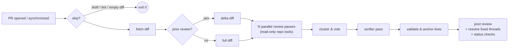

<p align="center">
  
  <h1 align="center">HoverStare</h1>
  <p align="center">
    <b>La revue de code IA qui lit vraiment votre dépôt.</b>
  </p>
  <p align="center">
    <i>Le nom vient du gag du film de Stephen Chow « 凌空瞪 » : un œil désincarné flottant dans les airs qui vous fixe.</i>
  </p>
  <p align="center">
    <a href="https://github.com/liuchong/hoverstare/actions/workflows/ci.yml"></a>
    <a href="https://github.com/liuchong/hoverstare/releases"></a>
    <a href="https://crates.io/crates/hoverstare"></a>
    <a href="https://license.pub/1pl/"></a>
  </p>
  <p align="center">
    <a href="README.md">English</a> ·
    <a href="README.zh-CN.md">简体中文</a> ·
    <a href="README.ru.md">Русский</a> ·
    <b>Français</b> ·
    <a href="README.de.md">Deutsch</a> ·
    <a href="README.es.md">Español</a>
  </p>
</p>

<br/>

HoverStare est un bot de revue de code IA pour les pull requests GitHub, écrit en
Rust et distribué comme un binaire statique unique s'exécutant en tant que
GitHub Action. Au lieu d'envoyer le diff à un modèle en une seule passe, son
réviseur **lit votre dépôt comme le ferait un humain** — il ouvre les fichiers
de contexte, cherche les sites d'appel avec grep, compare avec la branche de
base — avant de conclure. Un vote multi-passes et un vérificateur indépendant
réduisent les faux positifs, et chaque anomalie signalée est suivie d'un
commit à l'autre jusqu'à sa correction.

## Pourquoi HoverStare ?

- 🔍 **Conscient du dépôt, pas seulement du diff.** Le modèle dispose d'outils
  en lecture seule (`read_file` / `grep` / `glob` / `show_base_file`) et
  vérifie ses soupçons avant de signaler. Il détecte des bugs cachés *hors* du
  diff — comme une fonction modifiée dont les appelants cassent à deux fichiers
  de distance.
- 🗳️ **Vote multi-passes + vérificateur.** Trois passes indépendantes
  (exactitude / concurrence / sécurité) votent sur les anomalies ; celles à
  une seule voix doivent passer un vérificateur indépendant avec accès aux outils.
- 📌 **Commentaires en ligne précis.** Les numéros de ligne sont validés contre
  le vrai diff et ajustés à l'ancre valide la plus proche — les commentaires
  tombent exactement là où se trouve le bug.
- 🔁 **Revues incrémentales.** Poussez un correctif et HoverStare ne revoit que le
  delta, marque les anomalies corrigées comme résolues (ou laisse une note
  « ✅ correction confirmée ») et ne se répète jamais.
- 🛡️ **Fail-open par conception.** Problèmes réseau, limites de débit ou modèle
  capricieux ne bloqueront jamais votre CI.
- 🔑 **BYOK.** Apportez votre clé : Anthropic ou tout endpoint compatible
  OpenAI (Kimi, DeepSeek, OpenRouter, …). Le code va directement chez votre
  fournisseur.

## Comment ça marche



Chaque commentaire en ligne porte une empreinte cachée (hachage
`chemin + ligne de code + titre`). Au prochain push, HoverStare compare avec sa
revue précédente, demande au modèle quelles anomalies ouvertes sont corrigées,
et traite ces fils — insensible à la dérive des numéros de ligne.

## Démarrage rapide (2 minutes)

**1. Ajoutez le workflow** — `.github/workflows/hoverstare.yml` :

```yaml
name: HoverStare
on:
  pull_request:
    types: [opened, reopened, synchronize]
  issue_comment:
    types: [created]
  pull_request_review_comment:
    types: [created]

permissions:
  contents: read
  pull-requests: write
  statuses: write

concurrency:
  group: hoverstare-${{ github.event.pull_request.number || github.event.issue.number }}
  cancel-in-progress: true

jobs:
  hoverstare:
    runs-on: ubuntu-latest
    steps:
      - uses: actions/checkout@v4
        with:
          fetch-depth: 0
      - uses: liuchong/hoverstare@v0
        env:
          GITHUB_TOKEN: ${{ secrets.GITHUB_TOKEN }}
          OPENAI_API_KEY: ${{ secrets.HOVERSTARE_LLM_KEY }}
          OPENAI_BASE_URL: ${{ vars.HOVERSTARE_LLM_BASE_URL }}
          HOVERSTARE_MODEL: ${{ vars.HOVERSTARE_MODEL }}   # ex. kimi-for-coding
```

**2. Configurez les identifiants LLM** (au choix) :

| Fournisseur | Paramètres |
|---|---|
| **Anthropic** | secret `ANTHROPIC_API_KEY` (modèle par défaut `claude-sonnet-4-6`) |
| **Compatible OpenAI** (Kimi, DeepSeek, OpenRouter…) | secret `OPENAI_API_KEY`, variable `OPENAI_BASE_URL` (ex. `https://api.kimi.com/coding/v1`), nom du modèle via `HOVERSTARE_MODEL` ou `model` dans `.github/hoverstare.toml` |

> ⚠️ Avec un endpoint compatible OpenAI, vous **devez** définir le nom du
> modèle — le défaut `claude-sonnet-4-6` n'existe pas là-bas.

**3. (Optionnel) Config du dépôt** — `.github/hoverstare.toml`, tous champs optionnels :

```toml
model = "kimi-for-coding"             # modèle principal de revue
reformat_model = "kimi-for-coding-highspeed"  # modèle bon marché pour la réparation de sortie
passes = 3                            # passes parallèles ; 1 désactive le vote
verify = true                         # vérificateur pour les anomalies à une voix
severity_threshold = "medium"         # en dessous → section Nitpicks uniquement
ignore = ["*.lock", "**/dist/**", "**/*.min.js"]
max_diff_kb = 400                     # budget de diff (troncature par priorité)
max_tool_calls = 20                   # budget d'appels d'outils
timeout_secs = 900
review_drafts = false
fail_closed = false                   # true → les échecs d'analyse font échouer la CI
status_checks = false                 # écrire les checks hoverstare / hoverstare-findings
set_temperature = true                # false pour les endpoints n'acceptant que la température par défaut
instructions = ""                     # focus de revue de l'équipe, injecté dans le prompt système
```

## Commandes `@hoverstare`

Dans les commentaires d'une PR (collaborateurs du dépôt uniquement) :

| Commande | Effet |
|---|---|
| `@hoverstare review` | Force une re-revue complète |
| `@hoverstare explain` | Répond dans le fil avec une explication en langage clair |
| `@hoverstare help` | Liste des commandes |

## FAQ

**Erreurs de permission à la publication ?**
Vérifiez les `permissions` du workflow (`pull-requests: write` requis) et que
*Settings → Actions → General → Workflow permissions* est sur "Read and write".

**"model not found" ?**
Vous avez configuré un endpoint compatible OpenAI mais pas de nom de modèle.
Définissez `HOVERSTARE_MODEL` (ou `model` dans `hoverstare.toml`).

**400 / invalid temperature ?**
Votre endpoint n'accepte que la température par défaut. Mettez
`set_temperature = false` dans `hoverstare.toml`.

**Les anomalies corrigées ne sont pas résolues ?**
Limitation de la plateforme GitHub : le `GITHUB_TOKEN` par défaut ne peut pas
appeler `resolveReviewThread`. HoverStare répond alors « ✅ correction confirmée »
dans le fil. Pour une résolution complète, stockez un PAT classique
(`repo` scope) comme secret `GH_PAT` et passez-le dans l'env du workflow.

**GitHub Enterprise ?**
Définissez `GITHUB_API_URL=https://<votre-hote-ghe>/api/v3`.

## Développement local

```bash
# Dry-run d'une revue complète d'une PR publique (sans publication)
export OPENAI_API_KEY=... OPENAI_BASE_URL=... HOVERSTARE_MODEL=...
cargo run -- review --repo owner/repo --pr 123 --dry-run

# Revue d'un fichier diff local (affiche la trace des appels d'outils)
cargo run --example local_review -- path/to.diff [base_ref]

cargo test                                   # tests unitaires + contrats httpmock
cargo clippy --all-targets -- -D warnings
cargo fmt
```

Les specs et le plan de jalons sont dans [`specs/`](specs/README.md) — la
source de vérité unique pour les décisions de conception.

## Licence

[1PL — One Public License](https://license.pub/1pl/)
