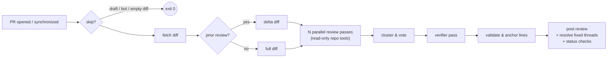

<p align="center">
  
  <h1 align="center">Bugbot</h1>
  <p align="center">
    <b>AI code review that actually reads your repo.</b>
  </p>
  <p align="center">
    <a href="https://github.com/liuchong/bugbot/actions/workflows/ci.yml"></a>
    <a href="https://github.com/liuchong/bugbot/releases"></a>
    <a href="https://crates.io/crates/bugbot"></a>
    <a href="https://license.pub/1pl/"></a>
  </p>
  <p align="center">
    <b>English</b> ·
    <a href="README.zh-CN.md">简体中文</a> ·
    <a href="README.ru.md">Русский</a> ·
    <a href="README.fr.md">Français</a> ·
    <a href="README.de.md">Deutsch</a> ·
    <a href="README.es.md">Español</a>
  </p>
</p>

<br/>

Bugbot is an AI code review bot for GitHub pull requests, written in Rust and
shipped as a single static binary that runs as a GitHub Action. Instead of
tossing a diff at a model in one shot, its reviewer **reads your repository
like a human reviewer would** — opening context files, grepping call sites,
comparing against the base branch — before it says anything. A multi-pass
vote plus an independent verifier keeps false positives down, and every
finding it reports is tracked across commits until it's fixed.

## Why Bugbot?

- 🔍 **Repo-aware, not diff-only.** The reviewing model gets a read-only tool
  set (`read_file` / `grep` / `glob` / `show_base_file`) and uses it to verify
  suspicions before reporting. It catches bugs that hide *outside* the diff —
  like a changed function whose callers break two files away.
- 🗳️ **Multi-pass voting + verifier.** Three independent review passes
  (correctness / concurrency / security lenses) vote on findings; lone-vote
  findings must survive an independent verifier pass with tool access.
  High signal, low noise.
- 📌 **Precise inline comments.** Line numbers are validated against the real
  diff and snapped to the nearest valid anchor, so comments land exactly where
  the bug is — never on the wrong line.
- 🔁 **Incremental reviews.** Push a fix and Bugbot reviews only the delta,
  marks fixed findings as resolved (or leaves a "✅ confirmed fixed" note),
  and never repeats itself.
- 🛡️ **Fail-open by design.** Network trouble, rate limits, or a flaky model
  will never block your CI.
- 🔑 **BYOK.** Bring your own key: Anthropic, or any OpenAI-compatible endpoint
  (Kimi, DeepSeek, OpenRouter, …). Code goes straight to your provider.

## How it works



Every inline comment carries a hidden fingerprint (`path + code line + title`
hash). On the next push, Bugbot diffs against its previous review, asks the
model which open findings are fixed, and resolves those threads — immune to
line-number drift.

## Quick start (2 minutes)

**1. Add the workflow** — `.github/workflows/bugbot.yml`:

```yaml
name: Bugbot
on:
  pull_request:
    types: [opened, reopened, synchronize]
  issue_comment:
    types: [created]
  pull_request_review_comment:
    types: [created]

permissions:
  contents: read
  pull-requests: write
  statuses: write

concurrency:
  group: bugbot-${{ github.event.pull_request.number || github.event.issue.number }}
  cancel-in-progress: true

jobs:
  bugbot:
    runs-on: ubuntu-latest
    steps:
      - uses: actions/checkout@v4
        with:
          fetch-depth: 0
      - uses: liuchong/bugbot@v0
        env:
          GITHUB_TOKEN: ${{ secrets.GITHUB_TOKEN }}
          OPENAI_API_KEY: ${{ secrets.BUGBOT_LLM_KEY }}
          OPENAI_BASE_URL: ${{ vars.BUGBOT_LLM_BASE_URL }}
          BUGBOT_MODEL: ${{ vars.BUGBOT_MODEL }}   # e.g. kimi-for-coding
```

**2. Configure LLM credentials** (pick one):

| Provider | Settings |
|---|---|
| **Anthropic** | secret `ANTHROPIC_API_KEY` (default model `claude-sonnet-4-6`) |
| **OpenAI-compatible** (Kimi, DeepSeek, OpenRouter…) | secret `OPENAI_API_KEY`, var `OPENAI_BASE_URL` (e.g. `https://api.kimi.com/coding/v1`), and a model name via var `BUGBOT_MODEL` or `model` in `.github/bugbot.toml` |

> ⚠️ With an OpenAI-compatible endpoint you **must** set the model name —
> the default `claude-sonnet-4-6` won't exist there.

**3. (Optional) Repo config** — `.github/bugbot.toml`, every field optional:

```toml
model = "kimi-for-coding"             # main review model
reformat_model = "kimi-for-coding-highspeed"  # cheap model for output repair
passes = 3                            # parallel review passes; 1 disables voting
verify = true                         # verifier pass for single-vote findings
severity_threshold = "medium"         # below this → Nitpicks section only
ignore = ["*.lock", "**/dist/**", "**/*.min.js"]
max_diff_kb = 400                     # diff budget (truncated by priority)
max_tool_calls = 20                   # agentic loop tool budget
timeout_secs = 900
review_drafts = false
fail_closed = false                   # true → analysis failures fail CI
status_checks = false                 # write bugbot / bugbot-findings checks
set_temperature = true                # false for endpoints that only accept default temperature
instructions = ""                     # team-specific review focus, injected into the system prompt
```

## `@bugbot` commands

Post in a PR (repo collaborators only):

| Command | What it does |
|---|---|
| `@bugbot review` | Force a full re-review |
| `@bugbot explain` | Reply in the thread with a plain-language explanation of the finding |
| `@bugbot help` | Command list |

## FAQ

**Reviews/comments fail with permission errors?**
Check workflow `permissions` (`pull-requests: write` required) and repo
*Settings → Actions → General → Workflow permissions* is "Read and write".

**"model not found"?**
You configured an OpenAI-compatible endpoint but no model name. Set
`BUGBOT_MODEL` (or `model` in `bugbot.toml`).

**400 / invalid temperature?**
Your endpoint only accepts the default temperature. Set
`set_temperature = false` in `bugbot.toml`.

**Fixed findings aren't getting resolved?**
A GitHub platform limitation: the default `GITHUB_TOKEN` cannot call
`resolveReviewThread`. Bugbot falls back to a "✅ confirmed fixed" reply in
the thread. For full resolution, store a classic PAT (`repo` scope) as secret
`GH_PAT` and pass it in the workflow env.

**GitHub Enterprise?**
Set `GITHUB_API_URL=https://<your-ghe-host>/api/v3`.

## Local development

```bash
# Dry-run a full review of a public PR (no publishing)
export OPENAI_API_KEY=... OPENAI_BASE_URL=... BUGBOT_MODEL=...
cargo run -- review --repo owner/repo --pr 123 --dry-run

# Review a local diff file (prints tool-call trace)
cargo run --example local_review -- path/to.diff [base_ref]

cargo test                                   # unit + httpmock contract tests
cargo clippy --all-targets -- -D warnings
cargo fmt
```

Specs and the milestone plan live in [`specs/`](specs/README.md) — the single
source of truth for design decisions.

## License

[1PL — One Public License](https://license.pub/1pl/)
