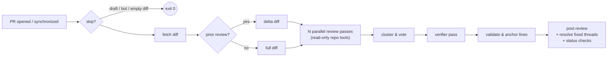

<p align="center">
  
  <h1 align="center">HoverStare</h1>
  <p align="center">
    <b>Revisión de código con IA que realmente lee tu repositorio.</b>
  </p>
  <p align="center">
    <i>El nombre viene del gag de la película de Stephen Chow «凌空瞪»: un ojo incorpóreo flotando en el aire, mirándote fijamente.</i>
  </p>
  <p align="center">
    <a href="https://github.com/liuchong/hoverstare/actions/workflows/ci.yml"></a>
    <a href="https://github.com/liuchong/hoverstare/releases"></a>
    <a href="https://crates.io/crates/hoverstare"></a>
    <a href="https://license.pub/1pl/"></a>
  </p>
  <p align="center">
    <a href="../../README.md">English</a> ·
    <a href="README.zh-CN.md">简体中文</a> ·
    <a href="README.ru.md">Русский</a> ·
    <a href="README.fr.md">Français</a> ·
    <a href="README.de.md">Deutsch</a> ·
    <b>Español</b>
  </p>
</p>

<br/>

HoverStare es un bot de revisión de código con IA para pull requests de GitHub,
escrito en Rust y distribuido como un único binario estático que se ejecuta
como GitHub Action. En lugar de lanzar el diff a un modelo de una sola vez, su
revisor **lee tu repositorio como lo haría un humano** — abre archivos de
contexto, busca sitios de llamada con grep, compara con la rama base — antes
de concluir. Una votación multipaso más un verificador independiente mantiene
bajos los falsos positivos, y cada hallazgo se rastrea entre commits hasta que
se corrige.

## ¿Por qué HoverStare?

- 🔍 **Consciente del repo, no solo del diff.** El modelo dispone de
  herramientas de solo lectura (`read_file` / `grep` / `glob` /
  `show_base_file`) y verifica sus sospechas antes de reportar. Detecta bugs
  que se esconden *fuera* del diff — como una función modificada cuyos
  invocadores se rompen dos archivos más allá.
- 🗳️ **Votación multipaso + verificador.** Tres pasadas independientes
  (corrección / concurrencia / seguridad) votan los hallazgos; los de un solo
  voto deben superar un verificador independiente con acceso a herramientas.
- 📌 **Comentarios en línea precisos.** Los números de línea se validan contra
  el diff real y se ajustan al ancla válida más cercana — los comentarios caen
  exactamente donde está el bug.
- 🔁 **Revisiones incrementales.** Al empujar una corrección, HoverStare revisa
  solo el delta, marca los hallazgos corregidos como resueltos (o deja una
  nota «✅ corrección confirmada») y nunca se repite.
- 🛡️ **Fail-open por diseño.** Problemas de red, límites de tasa o un modelo
  inestable nunca bloquearán tu CI.
- 🔑 **BYOK.** Trae tu propia clave: Anthropic o cualquier endpoint compatible
  con OpenAI (Kimi, DeepSeek, OpenRouter, …). El código va directo a tu
  proveedor.

## Cómo funciona



Cada comentario en línea lleva una huella oculta (hash de
`ruta + línea de código + título`). En el siguiente push, HoverStare compara con su
revisión anterior, pregunta al modelo qué hallazgos abiertos están corregidos
y procesa esos hilos — inmune a la deriva de números de línea.

## Inicio rápido (2 minutos)

**1. Añade el workflow** — `.github/workflows/hoverstare.yml`:

```yaml
name: HoverStare
on:
  pull_request:
    types: [opened, reopened, synchronize]
  issue_comment:
    types: [created]
  pull_request_review_comment:
    types: [created]

permissions:
  contents: read
  pull-requests: write
  statuses: write

concurrency:
  # 不含 @hoverstare 的评论事件给独立组名，避免无意义的 run 取消正在跑的审查
  group: >-
    hoverstare-${{
      (github.event_name == 'issue_comment' || github.event_name == 'pull_request_review_comment')
      && !contains(github.event.comment.body, '@hoverstare')
      && format('noop-{0}', github.event.comment.id)
      || (github.event.pull_request.number || github.event.issue.number)
    }}
  cancel-in-progress: true

jobs:
  hoverstare:
    runs-on: ubuntu-latest
    steps:
      - uses: actions/checkout@v4
        with:
          fetch-depth: 0
      - uses: liuchong/hoverstare@v0
        env:
          GITHUB_TOKEN: ${{ secrets.GITHUB_TOKEN }}
          OPENAI_API_KEY: ${{ secrets.HOVERSTARE_LLM_KEY }}
          OPENAI_BASE_URL: ${{ vars.HOVERSTARE_LLM_BASE_URL }}
          HOVERSTARE_MODEL: ${{ vars.HOVERSTARE_MODEL }}   # p. ej. kimi-for-coding
```

**2. Configura las credenciales LLM** (elige una):

| Proveedor | Configuración |
|---|---|
| **Anthropic** | secreto `ANTHROPIC_API_KEY` (modelo por defecto `claude-sonnet-4-6`) |
| **Compatible con OpenAI** (Kimi, DeepSeek, OpenRouter…) | secreto `OPENAI_API_KEY`, variable `OPENAI_BASE_URL` (p. ej. `https://api.kimi.com/coding/v1`), nombre del modelo vía `HOVERSTARE_MODEL` o `model` en `.github/hoverstare.toml` |

> ⚠️ Con un endpoint compatible con OpenAI **debes** definir el nombre del
> modelo — el predeterminado `claude-sonnet-4-6` no existe ahí.

**3. (Opcional) Config del repo** — `.github/hoverstare.toml`, todos los campos opcionales:

```toml
model = "kimi-for-coding"             # modelo principal de revisión
reformat_model = "kimi-for-coding-highspeed"  # modelo barato para reparar la salida
passes = 3                            # pasadas en paralelo; 1 desactiva la votación
verify = true                         # verificador para hallazgos de un solo voto
severity_threshold = "medium"         # por debajo → solo sección Nitpicks
ignore = ["*.lock", "**/dist/**", "**/*.min.js"]
max_diff_kb = 400                     # presupuesto de diff (truncado por prioridad)
max_tool_calls = 20                   # presupuesto de llamadas a herramientas
timeout_secs = 900
review_drafts = false
fail_closed = false                   # true → los fallos de análisis rompen la CI
status_checks = false                 # escribir checks hoverstare / hoverstare-findings
set_temperature = true                # false para endpoints que solo aceptan la temperatura por defecto
instructions = ""                     # enfoque de revisión del equipo, inyectado en el prompt de sistema
```

## Opcional: identidad de marca (publicación como tu propio bot)

Por defecto, las revisiones se publican como `github-actions[bot]` — limitación
del `GITHUB_TOKEN`, y **es el modo recomendado para la mayoría** (cero config).

¿Quieres identidad de marca? Registra **tu propia** GitHub App
(5 minutos, sin servidor — el intercambio de tokens ocurre dentro de GitHub Actions):

1. Crea una GitHub App en *Settings → Developer settings → GitHub Apps*
   (webhook **desactivado**; permisos: contents read, pull-requests write,
   issues write, commit statuses write) e instálala en tu repo
2. Guarda su App ID y clave privada como secretos `APP_ID` / `APP_PRIVATE_KEY`
3. Pásalos:

```yaml
      - uses: liuchong/hoverstare@v0
        with:
          app_id: ${{ secrets.APP_ID }}
          app_private_key: ${{ secrets.APP_PRIVATE_KEY }}
```

Las revisiones se publican como **tu-app[bot]**, y `resolveReviewThread`
funciona sin la limitación del `GITHUB_TOKEN` (sin necesidad de `GH_PAT`).

> La identidad `hoverstare[bot]` sin configuración para todos está planeada
> como servicio webhook autoalojable opcional `hoverstare serve`.

## Comandos `@hoverstare`

Publica en un PR (solo colaboradores del repo):

| Comando | Qué hace |
|---|---|
| `@hoverstare review` | Fuerza una revisión completa |
| `@hoverstare explain` | Responde en el hilo con una explicación sencilla del hallazgo |
| `@hoverstare help` | Lista de comandos |

## Preguntas frecuentes

**¿Errores de permisos al publicar?**
Revisa los `permissions` del workflow (`pull-requests: write` requerido) y que
*Settings → Actions → General → Workflow permissions* esté en "Read and write".

**¿"model not found"?**
Configuraste un endpoint compatible con OpenAI pero no el nombre del modelo.
Define `HOVERSTARE_MODEL` (o `model` en `hoverstare.toml`).

**¿400 / invalid temperature?**
Tu endpoint solo acepta la temperatura por defecto. Pon
`set_temperature = false` en `hoverstare.toml`.

**¿Los hallazgos corregidos no se resuelven?**
Una limitación de la plataforma GitHub: el `GITHUB_TOKEN` por defecto no puede
llamar a `resolveReviewThread`. HoverStare responde entonces «✅ corrección
confirmada» en el hilo. Para resolución completa, guarda un PAT clásico
(`repo` scope) como secreto `GH_PAT` y pásalo en el env del workflow.

**¿GitHub Enterprise?**
Define `GITHUB_API_URL=https://<tu-host-ghe>/api/v3`.

## Desarrollo local

```bash
# Dry-run de una revisión completa de un PR público (sin publicar)
export OPENAI_API_KEY=... OPENAI_BASE_URL=... HOVERSTARE_MODEL=...
cargo run -- review --repo owner/repo --pr 123 --dry-run

# Revisar un archivo diff local (imprime la traza de llamadas a herramientas)
cargo run --example local_review -- path/to.diff [base_ref]

cargo test                                   # tests unitarios + de contrato httpmock
cargo clippy --all-targets -- -D warnings
cargo fmt
```

Las specs y el plan de hitos están en [`specs/`](specs/README.md) — la fuente
única de verdad para las decisiones de diseño.

## Licencia

[1PL — One Public License](https://license.pub/1pl/)
