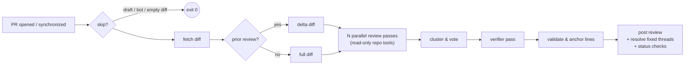

<p align="center">
  
  <h1 align="center">HoverStare</h1>
  <p align="center">
    <b>ИИ-ревью кода, которое действительно читает ваш репозиторий.</b>
  </p>
  <p align="center">
    <i>Название — от гэга из фильма Стивена Чоу «凌空瞪»: отделённый от тела глаз, парящий в воздухе и пристально смотрящий на вас.</i>
  </p>
  <p align="center">
    <a href="https://github.com/liuchong/hoverstare/actions/workflows/ci.yml"></a>
    <a href="https://github.com/liuchong/hoverstare/releases"></a>
    <a href="https://crates.io/crates/hoverstare"></a>
    <a href="https://license.pub/1pl/"></a>
  </p>
  <p align="center">
    <a href="../../README.md">English</a> ·
    <a href="README.zh-CN.md">简体中文</a> ·
    <b>Русский</b> ·
    <a href="README.fr.md">Français</a> ·
    <a href="README.de.md">Deutsch</a> ·
    <a href="README.es.md">Español</a>
  </p>
</p>

<br/>

HoverStare — это ИИ-бот для код-ревью пул-реквестов GitHub, написанный на Rust и
поставляемый как единый статический бинарник, работающий как GitHub Action.
Вместо того чтобы отправить diff модели за один проход, ревьюер **читает ваш
репозиторий, как это сделал бы человек** — открывает файлы с контекстом, ищет
места вызова через grep, сравнивает с базовой веткой — и только потом делает
выводы. Многопроходное голосование и независимый верификатор снижают число
ложных срабатываний, а каждая найденная проблема отслеживается между коммитами
до её исправления.

## Почему HoverStare?

- 🔍 **Понимает репозиторий, а не только diff.** У модели есть набор
  read-only инструментов (`read_file` / `grep` / `glob` / `show_base_file`),
  и она проверяет подозрения перед отчётом. Находит баги *за пределами* diff —
  например, когда изменённая функция ломает вызывающий её код в других файлах.
- 🗳️ **Многопроходное голосование + верификатор.** Три независимых прохода
  (корректность / конкурентность / безопасность) голосуют по находкам;
  находки с одним голосом проходят независимую проверку с доступом к инструментам.
- 📌 **Точные встроенные комментарии.** Номера строк проверяются по реальному
  diff и привязываются к ближайшей допустимой строке — комментарии попадают
  именно туда, где находится баг.
- 🔁 **Инкрементальные ревью.** После пуша исправления HoverStare проверяет только
  дельту, отмечает исправленные находки как resolved (или оставляет
  «✅ исправление подтверждено») и никогда не повторяется.
- 🛡️ **Fail-open по дизайну.** Сетевые сбои, рейт-лимиты или нестабильная
  модель никогда не заблокируют ваш CI.
- 🔑 **BYOK.** Свой ключ: Anthropic или любой OpenAI-совместимый endpoint
  (Kimi, DeepSeek, OpenRouter, …). Код идёт напрямую к вашему провайдеру.

## Как это работает



Каждый встроенный комментарий содержит скрытый отпечаток (хэш
`путь + строка кода + заголовок`). При следующем пуше HoverStare сравнивает со
своим прошлым ревью, спрашивает у модели, какие открытые находки исправлены,
и обрабатывает эти треды — дрейф номеров строк не влияет на отпечаток.

## Быстрый старт (2 минуты)

**1. Добавьте workflow** — `.github/workflows/hoverstare.yml`:

```yaml
name: HoverStare
on:
  pull_request:
    types: [opened, reopened, synchronize]
  issue_comment:
    types: [created]
  pull_request_review_comment:
    types: [created]

permissions:
  contents: read
  pull-requests: write
  statuses: write

concurrency:
  # 不含 @hoverstare 的评论事件给独立组名，避免无意义的 run 取消正在跑的审查
  group: >-
    hoverstare-${{
      (github.event_name == 'issue_comment' || github.event_name == 'pull_request_review_comment')
      && !contains(github.event.comment.body, '@hoverstare')
      && format('noop-{0}', github.event.comment.id)
      || (github.event.pull_request.number || github.event.issue.number)
    }}
  cancel-in-progress: true

jobs:
  hoverstare:
    runs-on: ubuntu-latest
    steps:
      - uses: actions/checkout@v4
        with:
          fetch-depth: 0
      - uses: liuchong/hoverstare@v0.0.5
        env:
          GITHUB_TOKEN: ${{ secrets.GITHUB_TOKEN }}
          OPENAI_API_KEY: ${{ secrets.HOVERSTARE_LLM_KEY }}
          OPENAI_BASE_URL: ${{ vars.HOVERSTARE_LLM_BASE_URL }}
          HOVERSTARE_MODEL: ${{ vars.HOVERSTARE_MODEL }}   # например kimi-for-coding
```

**2. Настройте доступ к LLM** (на выбор):

| Провайдер | Настройки |
|---|---|
| **Anthropic** | секрет `ANTHROPIC_API_KEY` (модель по умолчанию `claude-sonnet-4-6`) |
| **OpenAI-совместимый** (Kimi, DeepSeek, OpenRouter…) | секрет `OPENAI_API_KEY`, переменная `OPENAI_BASE_URL` (например `https://api.kimi.com/coding/v1`), имя модели через `HOVERSTARE_MODEL` или `model` в `.github/hoverstare.toml` |

> ⚠️ Для OpenAI-совместимого endpoint **обязательно** укажите имя модели —
> модели по умолчанию `claude-sonnet-4-6` там не существует.

**3. (Опционально) Конфиг репозитория** — `.github/hoverstare.toml`, все поля необязательны:

```toml
model = "kimi-for-coding"             # основная модель ревью
reformat_model = "kimi-for-coding-highspeed"  # дешёвая модель для восстановления вывода
passes = 3                            # параллельные проходы; 1 отключает голосование
verify = true                         # верификатор для находок с одним голосом
severity_threshold = "medium"         # ниже порога — только раздел Nitpicks
ignore = ["*.lock", "**/dist/**", "**/*.min.js"]
max_diff_kb = 400                     # бюджет diff (усечение по приоритету)
max_tool_calls = 20                   # бюджет вызовов инструментов
timeout_secs = 900
review_drafts = false
fail_closed = false                   # true — ошибки анализа ломают CI
status_checks = false                 # писать проверки hoverstare / hoverstare-findings
set_temperature = true                # false для endpoint'ов, принимающих только температуру по умолчанию
instructions = ""                     # фокус ревью команды, добавляется в системный промпт
```

## Опционально: фирменная личность (публикации от вашего бота)

По умолчанию ревью публикуются от `github-actions[bot]` — ограничение
`GITHUB_TOKEN`, и это **рекомендуемый режим для большинства** (без лишней настройки).

Хотите фирменную личность? Зарегистрируйте **собственное** GitHub App
(5 минут, сервер не нужен — обмен токенов происходит внутри GitHub Actions):

1. Создайте GitHub App в *Settings → Developer settings → GitHub Apps*
   (webhook **выключен**; права: contents read, pull-requests write,
   issues write, commit statuses write) и установите в репозиторий
2. Сохраните App ID и private key как секреты `APP_ID` / `APP_PRIVATE_KEY`
3. Передайте:

```yaml
      - uses: liuchong/hoverstare@v0.0.5
        with:
          app_id: ${{ secrets.APP_ID }}
          app_private_key: ${{ secrets.APP_PRIVATE_KEY }}
```

Ревью будут публиковаться от **ваш-app[bot]**, а `resolveReviewThread`
работает без ограничения `GITHUB_TOKEN` (без `GH_PAT`).

> Нулевая настройка личности `hoverstare[bot]` для всех — в планах как
> опциональный self-hosted сервис `hoverstare serve`.

## Команды `@hoverstare`

В комментариях к PR (только для коллабораторов репозитория):

| Команда | Действие |
|---|---|
| `@hoverstare review` | Принудительный полный повторный ревью |
| `@hoverstare explain` | Ответить в треде простым объяснением находки |
| `@hoverstare help` | Список команд |

## Частые вопросы

**Ошибки прав при публикации ревью?**
Проверьте `permissions` в workflow (нужен `pull-requests: write`) и что в
*Settings → Actions → General → Workflow permissions* выбрано "Read and write".

**"model not found"?**
Вы настроили OpenAI-совместимый endpoint, но не указали имя модели.
Задайте `HOVERSTARE_MODEL` (или `model` в `hoverstare.toml`).

**400 / invalid temperature?**
Endpoint принимает только температуру по умолчанию.
Установите `set_temperature = false` в `hoverstare.toml`.

**Исправленные находки не закрываются?**
Ограничение платформы GitHub: стандартный `GITHUB_TOKEN` не может вызывать
`resolveReviewThread`. HoverStare отвечает в треде «✅ исправление подтверждено».
Для полного resolve сохраните classic PAT (`repo` scope) как секрет `GH_PAT`
и передайте его в env workflow.

**GitHub Enterprise?**
Установите `GITHUB_API_URL=https://<ваш-ghe-хост>/api/v3`.

## Локальная разработка

```bash
# Полный dry-run ревью публичного PR (без публикации)
export OPENAI_API_KEY=... OPENAI_BASE_URL=... HOVERSTARE_MODEL=...
cargo run -- review --repo owner/repo --pr 123 --dry-run

# Ревью локального diff-файла (печатает трассу вызовов инструментов)
cargo run --example local_review -- path/to.diff [base_ref]

cargo test                                   # модульные + контрактные тесты httpmock
cargo clippy --all-targets -- -D warnings
cargo fmt
```

Спецификации и план вех — в [`specs/`](specs/README.md), единственный
источник правды по проектным решениям.

## Лицензия

[1PL — One Public License](https://license.pub/1pl/)
