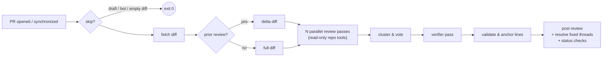

<p align="center">
  
  <h1 align="center">HoverStare</h1>
  <p align="center">
    <b>真正会读你仓库的 AI 代码审查。</b>
  </p>
  <p align="center">
    <i>名字来自周星驰电影梗"凌空瞪"——一只离体眼球悬浮半空，直勾勾瞪着你。</i>
  </p>
  <p align="center">
    <a href="https://github.com/liuchong/hoverstare/actions/workflows/ci.yml"></a>
    <a href="https://github.com/liuchong/hoverstare/releases"></a>
    <a href="https://crates.io/crates/hoverstare"></a>
    <a href="https://license.pub/1pl/"></a>
  </p>
  <p align="center">
    <a href="../../README.md">English</a> ·
    <b>简体中文</b> ·
    <a href="README.ru.md">Русский</a> ·
    <a href="README.fr.md">Français</a> ·
    <a href="README.de.md">Deutsch</a> ·
    <a href="README.es.md">Español</a>
  </p>
</p>

<br/>

HoverStare 是一个 Rust 编写的 AI 代码审查 bot，以单一静态二进制通过 GitHub Action
运行。它不是把 diff 一次性扔给模型，而是让审查模型**像人类 reviewer 一样翻阅仓库**——
读上下文文件、grep 调用点、对比 base 分支——确认之后再下结论。多路投票加独立复核
压制误报，每一条发现都会跨 commit 追踪直到修复。

## 为什么选择 HoverStare？

- 🔍 **仓库感知，不止于 diff。** 审查模型配有只读工具集
  （`read_file` / `grep` / `glob` / `show_base_file`），上报前先查证。
  能抓到藏在 diff 之外的 bug——比如被改函数的调用方在两个文件之外被破坏。
- 🗳️ **多路投票 + verifier。** 三路独立审查（正确性/并发/安全侧重）投票表决；
  单票发现必须过一道带工具的独立复核。高信噪比。
- 📌 **行内评论精确锚定。** 行号经过真实 diff 校验并按降级链吸附，
  评论精确落在问题行上。
- 🔁 **增量审查。** push 修复后只审增量；已修复的发现自动 resolve
  （或留下"✅ 已确认修复"标记），绝不重复评论。
- 🛡️ **fail-open 设计。** 网络故障、限流、模型抽风，永远不阻塞你的 CI。
- 🔑 **BYOK。** 自带 key：Anthropic 或任何 OpenAI 兼容端点
  （Kimi、DeepSeek、OpenRouter……），代码直达你的 provider。

## 工作原理



每条行内评论都带有隐藏指纹（`路径 + 代码行 + 标题` 的哈希）。下次 push 时，
HoverStare 与上一次审查做 diff，让模型判定哪些未关闭发现已被修复并处理对应线程——
行号漂移不影响指纹稳定性。

## 快速开始（2 分钟）

**1. 加 workflow** — `.github/workflows/hoverstare.yml`：

```yaml
name: HoverStare
on:
  pull_request:
    types: [opened, reopened, synchronize]
  issue_comment:
    types: [created]
  pull_request_review_comment:
    types: [created]

permissions:
  contents: read
  pull-requests: write
  statuses: write

concurrency:
  # 不含 @hoverstare 的评论事件给独立组名，避免无意义的 run 取消正在跑的审查
  group: >-
    hoverstare-${{
      (github.event_name == 'issue_comment' || github.event_name == 'pull_request_review_comment')
      && !contains(github.event.comment.body, '@hoverstare')
      && format('noop-{0}', github.event.comment.id)
      || (github.event.pull_request.number || github.event.issue.number)
    }}
  cancel-in-progress: true

jobs:
  hoverstare:
    runs-on: ubuntu-latest
    steps:
      - uses: actions/checkout@v4
        with:
          fetch-depth: 0
      - uses: liuchong/hoverstare@v0.0.5
        env:
          GITHUB_TOKEN: ${{ secrets.GITHUB_TOKEN }}
          OPENAI_API_KEY: ${{ secrets.HOVERSTARE_LLM_KEY }}
          OPENAI_BASE_URL: ${{ vars.HOVERSTARE_LLM_BASE_URL }}
          HOVERSTARE_MODEL: ${{ vars.HOVERSTARE_MODEL }}   # 如 kimi-for-coding
```

**2. 配 LLM 凭据**（二选一）：

| Provider | 配置 |
|---|---|
| **Anthropic** | secret `ANTHROPIC_API_KEY`（默认模型 `claude-sonnet-4-6`） |
| **OpenAI 兼容**（Kimi、DeepSeek、OpenRouter……） | secret `OPENAI_API_KEY`，var `OPENAI_BASE_URL`（如 `https://api.kimi.com/coding/v1`），模型名用 var `HOVERSTARE_MODEL` 或 `.github/hoverstare.toml` 的 `model` |

> ⚠️ 用 OpenAI 兼容端点时**必须**配模型名——默认的 `claude-sonnet-4-6` 在那里不存在。

**3.（可选）仓库配置** — `.github/hoverstare.toml`，全部字段可选：

```toml
model = "kimi-for-coding"             # 主审模型
reformat_model = "kimi-for-coding-highspeed"  # 输出修复用的廉价模型
passes = 3                            # 并行审查路数；1 = 关闭投票
verify = true                         # 单票 finding 过 verifier 复核
severity_threshold = "medium"         # 低于此级别只进 Nitpicks
ignore = ["*.lock", "**/dist/**", "**/*.min.js"]
max_diff_kb = 400                     # diff 大小预算（按优先级截断）
max_tool_calls = 20                   # agentic 循环工具预算
timeout_secs = 900
review_drafts = false
fail_closed = false                   # true 时分析失败会让 CI 失败
status_checks = false                 # 写 hoverstare / hoverstare-findings 检查
language = "en"     # 输出语言：en/zh-CN/ru/fr/de/es
set_temperature = true                # 端点只接受默认温度时置 false
instructions = ""                     # 团队特定关注点，注入系统提示
```

## 仓库指令文件

HoverStare 会读取仓库级规则文件并应用到审查中（补充但永不覆盖内建核心规则）。
优先级：

1. `hoverstare.md` / `.hoverstare.md` / `.hoverstare/*.md` / `.github/hoverstare.md`
2. `AGENTS.md`
3. `.github/copilot-instructions.md`、`CLAUDE.md`、`.cursorrules`

文件**从 base 分支读取**（修改 AGENTS.md 的 PR 无法注入指令）。
核心安全规则（只读工具、定点查证、缺陷范围、JSON 契约）永不可被覆盖。

## 可选：品牌身份（以你自己的 bot 发布）

默认情况下 review 以 `github-actions[bot]` 发布——这是 `GITHUB_TOKEN` 的限制，
也是**推荐给大多数用户的模式**（零额外配置）。

想要品牌身份？注册**你自己的** GitHub App（5 分钟，无需服务器——token 交换
发生在 GitHub Actions 内部），把凭据传给 action：

1. 在 *Settings → Developer settings → GitHub Apps* 创建 App
   （webhook **关闭**；权限：contents read、pull-requests write、
   issues write、commit statuses write），并安装到你的仓库
2. 把它的 App ID 和 private key 存为 secrets `APP_ID` / `APP_PRIVATE_KEY`
3. 传入：

```yaml
      - uses: liuchong/hoverstare@v0.0.5
        with:
          app_id: ${{ secrets.APP_ID }}
          app_private_key: ${{ secrets.APP_PRIVATE_KEY }}
```

此后 review 以**你的 App 名[bot]** 发布，且 `resolveReviewThread` 不受
`GITHUB_TOKEN` 平台限制（无需 `GH_PAT`）。

> 面向所有人的零配置 `hoverstare[bot]` 身份，规划为可选自部署的
> `hoverstare serve` webhook 服务。

## `@hoverstare` 命令

在 PR 评论中使用（仅 repo collaborator 可触发）：

| 命令 | 行为 |
|---|---|
| `@hoverstare review` | 强制全量重审 |
| `@hoverstare explain` | 在线程里通俗解释该发现 |
| `@hoverstare help` | 命令列表 |

## 开发模式：把 issue 和 PR 当作 AI 编程 IDE

HoverStare 还能**开发**——issue 和 PR 就是一个对话驱动的开发环境（spec 11）：

**Issue 主线**——提一个带 `@hoverstare` 的 issue：

1. 它会调查仓库，并在评论里回复分析 + 计划。
2. 直接回复即可讨论；每一轮它都在评论串里作答。
3. `@hoverstare go`——它会拉分支、实现、推送，并开出 PR（含 `Closes #N`）。

**PR 主线**——在任意本仓 PR 上：

- `@hoverstare <指令>`——它检出 PR 分支进行开发，提交（Conventional Commits，作者为 `hoverstare[bot]`）并推回该分支，然后评论汇报。预算耗尽的轮次会自我续跑（每个 PR 最多 10 轮）。
- `@hoverstare merge`——checks 全绿且无冲突后，它会 squash 合并。

配置：增加 `issues` 和 `pull_request_review` 触发器，并授予 `contents: write` + `issues: write` 权限。完整可用示例见 `.github/workflows/hoverstare.yml`。注意：

- 只有仓库协作者可以下达命令；fork PR 不在范围内。
- 推送请使用 `gh_pat` 输入传入 PAT，或具备 `contents: write` 的 GitHub App token——默认 `GITHUB_TOKEN` 的推送**不会**触发 CI，bot 提交将永远跑不了必需检查。

## 常见问题

**review/评论报权限错误？**
检查 workflow `permissions`（需要 `pull-requests: write`），以及仓库
Settings → Actions → General → Workflow permissions 是 "Read and write"。

**报 "model not found"？**
你用了 OpenAI 兼容端点但没配模型名。设 `HOVERSTARE_MODEL`（或 toml 的 `model`）。

**400 / invalid temperature？**
端点只接受默认 temperature。在 `hoverstare.toml` 置 `set_temperature = false`。

**已修复的发现没被 resolve？**
GitHub 平台限制：默认 `GITHUB_TOKEN` 无法调用 `resolveReviewThread`。
HoverStare 会降级为线程内回复"✅ 已确认修复"。如需完整 resolve，
创建 classic PAT（`repo` scope）存为 secret `GH_PAT` 并在 workflow env 传入。

**GitHub Enterprise？**
设 `GITHUB_API_URL=https://<你的 GHE 域名>/api/v3`。

## 本地开发

```bash
# 对公开 PR 完整 dry-run（不发布）
export OPENAI_API_KEY=... OPENAI_BASE_URL=... HOVERSTARE_MODEL=...
cargo run -- review --repo owner/repo --pr 123 --dry-run

# 审查本地 diff 文件（打印工具调用轨迹）
cargo run --example local_review -- path/to.diff [base_ref]

cargo test                                   # 单元 + httpmock 合约测试
cargo clippy --all-targets -- -D warnings
cargo fmt
```

设计文档与里程碑计划见 [`specs/`](specs/README.md)——设计决策的单一事实来源。

## Star 历史与贡献者

由 [RepoScope](https://github.com/liuchong/reposcope) 每日自动更新——提交到孤立分支 `reposcope`，绝不污染 `master`。

<picture>
  <source media="(prefers-color-scheme: dark)" srcset="https://raw.githubusercontent.com/liuchong/hoverstare/reposcope/assets/reposcope/star-history-dark.svg">
  
</picture>


## 许可证

[1PL — One Public License](https://license.pub/1pl/)
